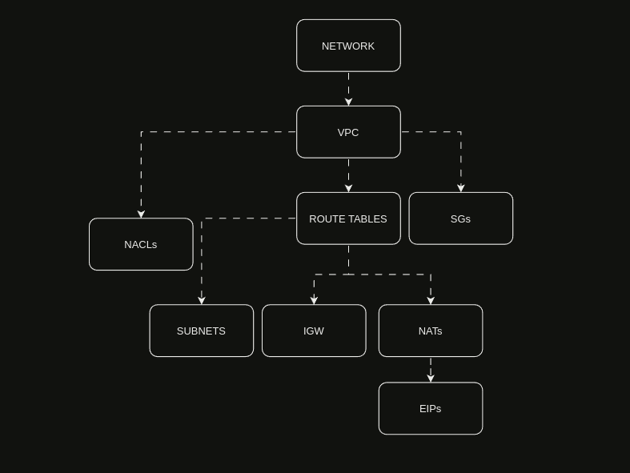
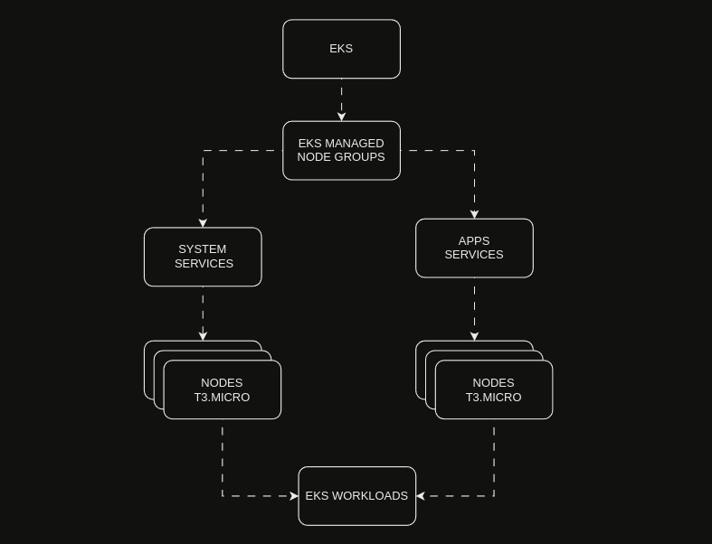

# Reveal Installation and Usage Guide


---

# REVEAL INFRA INSTALLATION AND USAGE GUIDE

## Table of Contents
1. [Requirements](#1-requirements)
2. [Deploy Infrastructure](#2-deploy-infrastructure)
3. [Deploy Services](#3-deploy-services)
4. [Network Overview](#4-network)
5. [EKS Cluster](#5-eks-cluster)
6. [Conclusion](#6-conclusion)

## 1. Requirements
1. you need install all the tools below:
- [terraform](./docs/terraform.md) - tools for provisioning and managing cloud infrastructure **required**
- [kubectl](./docs/kubectl.md) - command-line tool for Kubernetes **required**
- [aws cli](./docs/aws-cli.md) - command-line tool for AWS **required**
- [tfenv](./docs/tfenv.md) - terraform version manager **optional**
- [aws vault](./docs/aws-vault.md) - tool for securely storing and accessing AWS credentials in development environments **optional**

# Strucutre of folder


## 2. Deploy Infrastructure

### PROVISION INFRASTRUCTURE 

- Before getting started, make sure you have the following prerequisites installed and configured:
- Run AWS Vault to add your AWS credentials to the vault.
  ```bash
    aws-vault add $PROFILE
  ```
- Check if you have the necessary environment variables configured in the `.env` file.

- Run the command below to init and plan the infrastructure:
  ```bash
    make init_cluster && make plan_cluster
  ```
- If the plan is as expected, apply the infrastructure:
  ```bash
    make apply_cluster
  ```

## 3. Deploy Services

### PROVISION SERVICES 

The application provisions services by creating Helm applications in Argocd for each service via Terraform. An Argocd application needs to retrieve information and have access to the repository where the Helm charts are located. In this application, the service is located in the same repository as the project, in the **dev/us-east-2/services/apps/** folder, where all the Helm charts of the applications are found.
There are services created to enable features in applications by extending the Kubernetes API, such as:
- [External-Secrets](https://artifacthub.io/packages/helm/external-secrets-operator/external-secrets), which allows obtaining sensitive data from external sources, in this case, AWS Secrets Manager.
- [Nginx Ingress Controller](https://artifacthub.io/packages/helm/ingress-nginx/ingress-nginx), which acts as a load balancer, managing HTTP and HTTPS traffic being executed within the Kubernetes application.
- [Cert-Manager](https://artifacthub.io/packages/helm/cert-manager/cert-manager), which is a tool used to manage TLS certificates, responsible for ensuring security and communication within the environment.
- [ArgoCD](https://artifacthub.io/packages/helm/argo/argo-cd) is a tool that enables continuous deployment of applications in Kubernetes environments.

Terraform applications involve deploying Helm services in Argocd, the Terraform application modules are created in dev/us-east-2/modules. Each folder corresponds to a service, an ArgoCD [application has its own Kubernetes template](https://argo-cd.readthedocs.io/en/stable/operator-manual/declarative-setup/#applications) structure and is being deployed via Kubectl.
An example of a created ArgoCD application is:


This application deploys the monolith service, in the folder **dev/us-east-2/services/apps/monolith-service**.

  <!-- - Run the command below to init and plan the services:
  ```bash
    make init_services && make plan_services
  ``` -->

## 4. Network
Overview of the infrastructure created by terraform:

- A network was created with 6 subnets (3 public and 3 private) in 3 different availability zones.
- The traffic for the private network is routed through a NAT gateway.
- The traffic for the public network is routed through an internet gateway.
- Security groups were created to allow traffic between the subnets and to allow inbound and outbound network traffic.



## 5. EKS Cluster

- A Kubernetes cluster was created with 4 nodes divided into 2 node groups.
- Each node group is in a different availability zone, ensuring high availability.
- Services were created with high availability in mind.
- Nginx ingress controller was installed to manage incoming traffic.
- Prometheus was installed to collect cluster metrics.
- Grafana was installed to visualize the metrics collected by Prometheus.
- ArgoCD was installed to manage cluster deployments.





## 6. Conclusion

Remember to refer to the official documentation and guides for each tool to learn more about their features, usage, and best practices:

- AWS CLI Documentation: https://aws.amazon.com/cli/
- Terraform Documentation: https://www.terraform.io/docs/index.html
- Kubernetes Documentation: https://kubernetes.io/docs/home/
- Ansible Documentation: https://docs.ansible.com/ansible/latest/index.html


