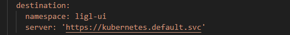

# Reveal Guide

# Strucutre of folder

## 1. Services

### Requirements
1. you need install all the tools below:
- [terraform](./docs/terraform.md) - tools for provisioning and managing cloud infrastructure **required**
- [kubectl](./docs/kubectl.md) - command-line tool for Kubernetes **required**
- [aws cli](./docs/aws-cli.md) - command-line tool for AWS **required**
- [aws vault](./docs/aws-vault.md) - tool for securely storing and accessing AWS credentials in development environments **optional**

### PROVISION SERVICES 

The application provisions services by creating Helm applications in Argocd for each service via Terraform. An Argocd application needs to retrieve information and have access to the repository where the Helm charts are located. In this application, the service is located in the same repository as the project, in the **dev/us-east-2/services/apps/** folder, where all the Helm charts of the applications are found.
There are services created to enable features in applications by extending the Kubernetes API, such as:
- [External-Secrets](https://artifacthub.io/packages/helm/external-secrets-operator/external-secrets), which allows obtaining sensitive data from external sources, in this case, AWS Secrets Manager.
- [Nginx Ingress Controller](https://artifacthub.io/packages/helm/ingress-nginx/ingress-nginx), which acts as a load balancer, managing HTTP and HTTPS traffic being executed within the Kubernetes application.
- [Cert-Manager](https://artifacthub.io/packages/helm/cert-manager/cert-manager), which is a tool used to manage TLS certificates, responsible for ensuring security and communication within the environment.
- [ArgoCD](https://artifacthub.io/packages/helm/argo/argo-cd) is a tool that enables continuous deployment of applications in Kubernetes environments.

<!-- Terraform applications involve deploying Helm services in Argocd, the Terraform application modules are created in dev/us-east-2/modules. Each folder corresponds to a service, an ArgoCD [application has its own Kubernetes template](https://argo-cd.readthedocs.io/en/stable/operator-manual/declarative-setup/#applications) structure and is being deployed via Kubectl.
An example of a created ArgoCD application is:

 -->

<!-- This application deploys the monolith service, in the folder **dev/us-east-2/services/apps/monolith-service**. -->

### HOW HELM CHARTS WORKS:

Helm is a package manager for Kubernetes that allows deploying and managing applications in a Kubernetes cluster.

A chart is basically a set of YAML templates that describe Kubernetes resources.

Helm allows creating logic to meet the needs of applications, and this logic is implemented through the values referenced in the `values.yaml` file at the root of the Helm application.

Helm applications can be deployed using the `helm install` or `helm release` commands.

ArgoCD can deploy Helm applications, but it generates templates via the `helm template` command and executes Kubernetes templates.

The folder structure of a Helm application is as follows:

 

The "templates" folder contains the Kubernetes templates that may or may not be created, depending on the logic applied within each template.

 

An example of Kubernetes templates using Helm is the configMap template, look that the `name`, `namespace` and content of `appsettings.json` are placed on `values.yaml` file and represented in key/values types:

 

In this folder structure, all Helms charts are in folder **dev/us-east-2/services/apps**, each one are deployed separated by ArgoCD using Terraform structure.

### HOW TERRAFORM CREATES ARGOCD APPLICATIONS:

Terraform modules are located in the folder **dev/us-east-2/services/modules** and they work. ArgoCD applications can be created via Kubernetes templates. An example of an ArgoCD application template is:

Where the "kind" of the template needs to be referenced as "Application" so that ArgoCD can interpret it. Uploading an ArgoCD application in this way would be equivalent to creating a YAML file like the one above and running the command `kubectl apply -f filename.yaml`. Using the same concept above, we utilize the "kubectl_manifest" resource to apply the kubectl apply command behind the scenes.

 

In this way, the `kubectl_manifest.ligl-ui` resource in Terraform will execute the `kubectl apply`, applying the template created below. Thus, we have an application managed in ArgoCD.
Within the template, we have a "destination" key, which references which application ArgoCD will control.

 

In this specific example, we configure the namespace where the application controlled by ArgoCD will reside within Kubernetes.

 

ArgoCD can deploy Helm charts, and you can configure a private repository to store the Helm application templates and provide the path. In this specific case, we are using the same repositories for Terraform and for the Helm applications. The Helm applications are located in the folder **/dev/us-east-2/services/apps** and the Terraform modules are in **/dev/us-east-2/services/modules**. To configure the repository in ArgoCD via template, here is where I am deploying the Helm chart for ligl-ui:

 

ValuesFiles is the default values.yaml file designated by Helm, and the parameters are individual values being changed within the default values.yaml. This is how a Terraform code deploys an application to ArgoCD by passing a Helm application via source. When executing the module in main.tf, the above code block will be executed by Terraform.

 

